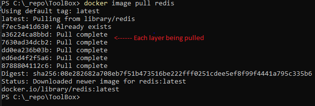

### [Home](../Home.md) | [Docker Home](./Docker.md)

# **Docker Images**

## **High level overview**
An image is a READ ONLY template for creating application containers. It contains all the code and supporting files to run an application.

At a high level an image is a bunch of files (app files / libraries / os files) along with a **manifest** (a json file explaining how it all fits together (sometimes called the config file)).

Images contain layers which are stacked on top of each other. Typically the layering is hidden and docker makes it feel like a single flat image (which it is not).

Images are generally stored in registries (cloud or on prem) which then can be pulled down to a machine using the following command:
```powershell
docker image pull
``` 
Once on the image is on local machine we can create and start containers from them.

As Images are **read only** and multiple containers can run off of a single image. Each container must have its own thin writeable layer which allows the container to write data.


## **Images in detail**
An image does not exist as a single blob or object, it is made up of independant layers which are loosley connected by the json manifest file (sometimes called the **config file**). When pulling an image with: 

```powershell
docker image pull imageName
```
With the example output below, you can see **each layer** is downloaded.



The manifest file describes the image (list of layers, how to stack the layers, ids, tags, when it was created).

Each image layer is a bunch of files (and, or objects) which do not have **any reference or connection** to the other layers.

By default docker pulls images over the internet from dockerhub, but can be configured to pull from a local repository.

Pulling an image is a 3 step process

    1. Get the FAT manifest (AKA Manifest list), this is a list of manifests available and which cpu architecture / os it supports, and then select the manifest which supports the host architecture / os
    2. Get the Manifest selected from the Manifest lsit / FAT manifes    
    3. Pull the layers listed in the manifest

Each layer is referenced via its hash value, the layer hash is a **sha256-hash** made up of all the files / objects within the layer.

Layering works in the following way:

    Base layer (usually an OS)
    Application (code / exectueables / libraries to run the app)
    Updates (optional updates)

The storage drive then combines all of these layers to present them as a single unified file system (ufs).

To inspect the configuration and layers of an image we can use the following command:
```powershell
docker image inspect ImageName
```

## **Pushing and Pulling Images to/from a registry**
We compute the content hash for each layer, this is known as the **content hash**.

When pushing an image to a registry the manifest and layers are pushed independantly, when pushing the layers we compress they are compressed before being transferred over the internet (to be more efficient). 

As layer ID's are content hashes and compressing a layer changes it's content, when pushing an image to a registry, a hash is generated to verify its integrity, this will fail as the hashes in the manifest do not reflect the computed hash at the registry end. 
To get around this, when we build the manifest which will be pushed to the registry we populate the registry with new hash values derived from the compressed layer which will then match when the registry performs the integrity check.

A hash derived from a compressed layer is known as a **distribution hash**.